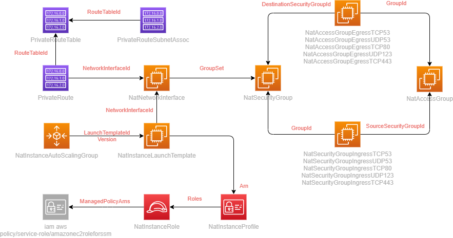

# AWS NAT Instance - CloudFormation Template

## Description

CloudFormation templates to deploy NAT instances inside an existing VPC.

## Usage

## Diagram

The following diagram helps to illustrate what is deployed.

